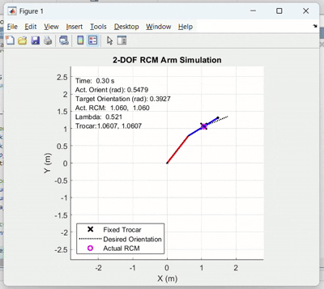
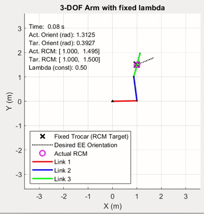

# Medical Robotics Simulations

This repository contains MATLAB simulations for medical robotics applications focused on Remote Center of Motion (RCM) control, a technique essential for minimally invasive surgery.

## Simulation 1: 2-DOF Kinematic RCM Control

The first simulation (`Homework.m`) implements a 2-DOF planar manipulator with RCM control, featuring:

- Two-link robotic arm with configurable link lengths
- Dynamic RCM positioning along the shaft (variable λ parameter)
- Task-based kinematic control that maintains:
    - Remote Center of Motion at a fixed trocar position
    - Specific tool orientation (π/8 radians)
- Null-space optimization for λ positioning
- Real-time visualization of robot motion and control parameters

This simulation demonstrates how surgical robots operate through a fixed entry point while maintaining proper tool orientation.

## Simulation 2: 4-DOF Advanced RCM Control

The second simulation (`Homework2.m`) extends to a 4-DOF manipulator with:

- Four-link planar robot with configurable parameters
- Fixed RCM point on link 2 (λ = 0.5)
- Hierarchical task control:
    1. Maintaining RCM position at trocar (2 DOF)
    2. Controlling tool vector orientation through the trocar
    3. Controlling distal link orientation for end-effector precision
- Comprehensive visualization of all links, joints, and control targets

This implementation models more complex surgical scenarios requiring precise end-effector control.

## Usage

Run either file in MATLAB to start the simulation. The robot automatically moves toward the desired configuration until convergence or timeout.

Key parameters (initial pose, link dimensions, control gains) can be adjusted at the top of each file.

## Requirements

- MATLAB
- Symbolic Math Toolbox